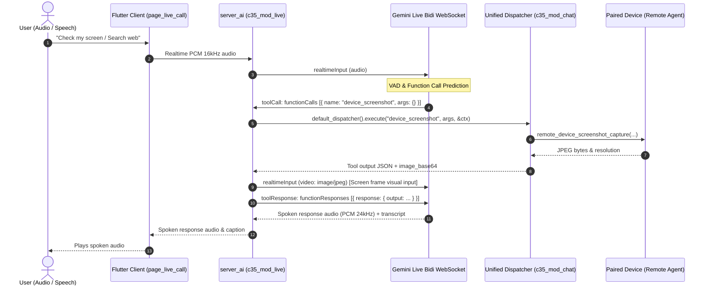

# Live Call

Voice sessions on the home welcome screen, separate from the chat model picker.

Live Call is duplex audio, billed per minute, on `ai.live_offer`. **Talk** is turn-based: the same Home thread, mic in, one prompt out ([ui.md](ui.md#talk)). A Talk send does not call `ReqLiveStart`.

## Catalog

Rows in **`ai.live_offer`** (see `_/schemas/live_offer.sql`). Not synced into `ai.llm_model`. Session init returns **`LiveCatalog`** on `ResSessionInit.live`.

| id | UI | Backend (v1) |
|----|-----|----------------|
| `live.alienai` | Call Alien AI | `gemini-3.8-live` + `inst.general` |
| `live.gemini` | Call Gemini | `gemini-3.8-live` |
| `live.gemini.thinker` | Call Gemini Thinker | `gemini-3.8-live-extended-thinking` |
| `live.chatgpt` | Call ChatGPT | `gpt-4o-realtime-preview` via Cloudflare AI Gateway |
| `live.grok` | Call Grok | `grok-2-latest` / `grok-2-vision-1212` via Cloudflare AI Gateway |

Retail **~$/min** on chip = `(input_usd_per_min + output_usd_per_min) × 1.5`.

## Voices & Personas

Gemini Multimodal Live API (`BidiGenerateContent`) supports 30 prebuilt neural voice personas configured via `generationConfig.speechConfig.voiceConfig.prebuiltVoiceConfig.voiceName`.

- **Platform Default**: **`Callirrhoe`** (*Easy-going, balanced, conversational tone*).
- **Environment Override**: `GEMINI_LIVE_VOICE=<VoiceName>` (e.g. `GEMINI_LIVE_VOICE=Puck`).

### Complete Catalog of 30 Supported Voices

| Voice | Persona / Tone Style | Voice | Persona / Tone Style |
|:---|:---|:---|:---|
| **Callirrhoe** | Easy-going, warm *(Default)* | **Aoede** | Breezy, cheerful |
| **Zephyr** | Bright, crisp | **Puck** | Upbeat, energetic |
| **Charon** | Informative, steady male | **Kore** | Firm, professional female |
| **Fenrir** | Excitable, dynamic | **Leda** | Youthful, friendly |
| **Orus** | Firm, deep male | **Sulafat** | Warm, conversational |
| **Autonoe** | Bright, lively | **Enceladus** | Breathy, gentle |
| **Iapetus** | Clear, articulate | **Umbriel** | Easy-going, relaxed |
| **Algieba** | Smooth, balanced | **Despina** | Smooth, melodic |
| **Erinome** | Clear, direct | **Algenib** | Gravelly, textured |
| **Rasalgethi** | Informative, instructional | **Laomedeia** | Upbeat, bright |
| **Achernar** | Soft, soothing | **Alnilam** | Firm, authoritative |
| **Schedar** | Even, measured | **Gacrux** | Mature, grounded |
| **Pulcherrima** | Forward, assertive | **Achird** | Friendly, approachable |
| **Zubenelgenubi**| Casual, conversational | **Vindemiatrix**| Gentle, empathetic |
| **Sadachbia** | Lively, animated | **Sadaltager** | Knowledgeable, executive |

All voices feature native multilingual pronunciation and automatic code-switching (including Indonesian, English, Japanese, and 30+ languages).

## Costing, Profit Economics & Safe Margins

### 1. Upstream Wholesale (Google Gemini Live API)
Google Gemini Multimodal Live API (`BidiGenerateContent`) charges upstream per audio/text token:
- **Audio Input**: $3.00 / 1,000,000 tokens ($\approx 25$ tokens/sec $\approx \$0.0045 - \$0.005$ / minute).
- **Audio Output**: $12.00 / 1,000,000 tokens ($\approx 25$ tokens/sec $\approx \$0.018$ / minute).
- **Text & System Instruction**: $0.15 / 1M input, $0.60 / 1M output (negligible).

**Total Wholesale Cost**:
- **USD**: $\$0.023$ / minute ($\approx \$0.000383$ / second).
- **IDR** (at reference rate Rp 17.630 / USD): $\approx \text{Rp } 405$ / minute ($\approx \text{Rp } 6.76$ / second).

### 2. Retail Pricing (Per-Second Abstraction)
Live calls are billed per elapsed second rather than exposing erratic token swings to end users:
- **Markup**: Platform standard $1.50\times$ retail multiplier (`RETAIL_MARKUP = 1.50`).
- **Retail Rate**:
  - **USD**: $\$0.0345$ / minute ($\approx \$0.000575$ / second).
  - **IDR**: $\approx \text{Rp } 608$ / minute ($\approx \text{Rp } 10.13$ / second).
- **Nominal Gross Markup**: $+50\%$ over wholesale ($33.3\%$ gross margin).

### 3. Safe Margin Expansion (Silence & Pauses)
Real-world profit margin exceeds the nominal $50\%$ markup because of natural audio cadence:
1. **Dead Air / Silence**: During thinking pauses, listening, or room silence, Gemini's audio encoder emits far fewer tokens than during active continuous speech.
2. **Continuous Elapsed Billing**: The client/server timer meters continuous elapsed session seconds.
3. In a typical phone conversation with $30\%–40\%$ natural silence or pauses, actual Google token COGS drops from $\text{Rp } 405$/min down to $\approx \text{Rp } 250–280$/min, while billing remains $\text{Rp } 608$/min, expanding effective gross profit to **$70\%–120\%+$**.
4. **Subscription Breakage**: Unused monthly quota pools do not roll over, capturing full subscription value for unconsumed minutes.

### 4. Quota Pool Routing (CRITICAL: Frontier Pool Only)
Live Call **must always consume the Frontier (API) quota pool** (`frontier_pool_used_idr` / `alien_allow_5h_used`), **never** the internal Alien AI pool:

| Plan | Price / mo | Frontier Pool (Live Call Cap) | Max Live Call Minutes | Max Google COGS | Guaranteed Plan Profit | Margin % |
|:---|:---|:---|:---|:---|:---|:---|
| **Lite** | Rp 59.000 | Rp 20.000 | ~33 mins | Rp 13.365 | **+Rp 45.635** | **77.3%** |
| **Plus** | Rp 105.000 | Rp 35.000 | ~58 mins | Rp 23.490 | **+Rp 81.510** | **77.6%** |
| **Pro** | Rp 340.000 | Rp 115.000 | ~189 mins | Rp 76.545 | **+Rp 263.455** | **77.5%** |
| **Ultra** | Rp 1.200.000 | Rp 400.000 | ~658 mins | Rp 266.490 | **+Rp 933.510** | **77.8%** |

#### Why Alien AI Pool is Strictly Prohibited for Live Call
The Alien AI pool is sized for cheap internal text tokens ($1.50 / $7.00 per 1M nominal rate, with massive Rp 100.000+ pools on Lite). If Live Call were allowed to consume the Alien AI pool:
- A Lite user could make $100.000 / 608 \approx 164$ minutes of live calls.
- Google wholesale bill: $164 \text{ min} \times \text{Rp } 405 = \text{Rp } 66.420$.
- With a plan price of Rp 59.000, the platform would incur a **net loss of -Rp 7.420**.
Therefore, routing to the **Frontier Pool is an invariant safety boundary**.

### 5. UI Presentation & "(Included)" Badge
- **Idle / Pre-Call Chip**: If the user has remaining Frontier quota or 5h allowance, the badge displays `~Rp 10/s (~Rp 609/m) (Included)`.
- **Active Call Timer**: Displays elapsed time (e.g. `00:23`) and accrued cost `Rp 230 (Included) · billed per second`.
- **Quota Depletion**: When quota is exhausted, `(Included)` drops away and charges deduct seamlessly from the user's cash wallet balance.

## Unified Tool Pipeline & Device Awareness

Live Call attaches directly to the unified cluster tool pipeline in `c35_mod_chat::tools` rather than creating a fragmented or separate execution path.



### 1. Tool Declaration & Gating
- At session setup, `live_tool_select` declares a topic bundle, not the full registry. Cap is 32.
  1. `live.alienai` offer topics are `general`. Other offers with empty `tool_topics` declare no cluster tools.
  2. Device topics (`device`, `computer_use`) are added when the caller has a paired remote.
  3. Site topics (`web.builder`, `site.commerce`) are added only when the active mention resolves a site (`default_site_iid`).
  4. Staff tools (`requires_global_roles`) are never declared.
- `ReqLiveStart.mention_ids` sets that mention. If the list is empty, the server reads the chat's sticky mentions and `bound_device_iid`.
- A mention change sends `{"type":"mention","mention_ids":[...],"label":"..."}` on the app socket.
- **Make-Before-Break Handover**: The server does NOT tear down the old Gemini connection before setting up the new one. The existing connection remains active and processes user audio with 0ms dead air while a background task pre-warms the new connection, executes DB hydration, sends setup with `sessionResumption.handle`, and awaits `setupComplete`. Once confirmed, sockets are atomically swapped and the old socket closes cleanly.
- **Autonomous Topic Reset & Drift Detection**:
  - When an active mention is set, Gemini Live is declared the `topic_reset` tool and given prompt steering (`[TOPIC FOCUS]`) to call `topic_reset` if the user naturally changes the subject to general matters.
  - As a deterministic safety net, if 5 consecutive conversation turns complete without any mention tools called, the server automatically demotes the session to general topic and broadcasts `{"live":"mention","mention_ids":[],"label":"","switching":false}` to clear the client chip.
- **Video Perception & Frame Streaming**: Incoming client frames matching `{"type":"video","data":"<base64>","mime_type":"image/jpeg"}` (or `"video_frame"`) are relayed straight into Gemini Live's `realtimeInput.video` endpoint alongside tool-based `device_screenshot` frames.
- Talk uses the same center chip and the normal prompt pipeline. It does not reconnect.

### 2. Paired Devices Context & Auto-Resolution
- When the live session starts, the server discovers the caller's paired remote devices (`ai.identity` with `kind = 'remote'`).
- Injects a `[PAIRED DEVICES]` block into `systemInstruction`:
  ```text
  [PAIRED DEVICES]
  - DESKTOP-ABC (device_iid: 1048576, type: desktop, status: online)
  When the user asks you to interact with their computer, check screen, run commands, open apps, click or type, use the device tools (device_screenshot, shell_run, device_input, etc.). If there is only one device paired, device_iid is automatically resolved.
  ```
- If the user has a single paired device, `device_iid_resolve(&ctx.mention, &[], 0)` automatically binds it so the user can naturally say *"take a screenshot"* or *"open Chrome"* without speaking long IDs.

### 3. Visual Perception Screen Streaming
- When `device_screenshot` executes during a live call, the captured JPEG frame is streamed directly to Gemini Live via `realtimeInput.video`.
- Gemini Live ingests the frame into its native multimodal vision encoder, while the textual `toolResponse` receives compact metadata.
- This allows Gemini to **literally see and talk about what is on the user's desktop screen** in real time with human-like conversation.

### 4. Grounding via Unified Web Search Tool (`web.search`)
- Rather than delegating web search to an opaque upstream Google Search tool, Live Call declares our cluster's unified `web_search` (`web.search`) tool directly to Gemini Live.
- **Why use our own web search tool for grounding?**
  1. **Consistent Multi-Source Grounding**: Employs the same search providers, ranking heuristics, locale boosts (e.g. Indonesian regional data, local currency conversions), and content extraction used in text chat.
  2. **Auditability & Logging**: Every search triggered during a live voice call is recorded in `ai.log` with prompt tokens, duration, and query metadata.
  3. **Unified Cache & Cost Control**: Queries leverage cluster search caching, preventing redundant upstream billing when users ask related questions.
- **Protocol Flow**:
  1. Gemini Live recognizes the need for current information and emits `toolCall: { functionCalls: [{ name: "web_search", args: { "query": "..." } }] }`.
  2. The server executes `default_dispatcher().execute("web_search", args, &ctx)`.
  3. Returns `toolResponse: { functionResponses: [{ name: "web_search", response: { output: <search_results> } }] }`.
  4. Gemini Live seamlessly processes the grounding data and speaks the grounded answer.

### 5. Verified End-to-End Smoke Test (`live_device_tool_smoke`)
Run the end-to-end integration binary against Gemini Live with real audio:
```powershell
cd servers
cargo run -p c35_mod_live --bin live_device_tool_smoke
```

**Verified Test Results**:
1. **Device Awareness Turn**:
   - Audio Input: *"What devices do I have connected to my account?"* (16kHz PCM audio).
   - Gemini Live Spoken Output:
     > *"You have four devices connected: DESKTOP-D8406DF, Chito Browser, and Chito's Google Chrome, which are online, plus a Google Android phone that's in standby."*
   - Status: **100% accurate** matching the 4 registered devices in `ai.identity` for `owner_iid = 99000`.
2. **Web Grounding Turn**:
   - Audio Input: *"Search the web for what is the latest price of Ethereum in USD."*
   - Gemini Tool Call: `web_search` (`query: "current price of Ethereum in USD"`).
   - Cluster Tool Execution: `default_dispatcher()` executed `web.search` successfully.
   - Grounded Spoken Output:
     > *"Ethereum is currently around 2,478 US dollars, but it might vary slightly depending on the exchange."*

## Welcome chip UX

Composer family drives **primary label**; **`live_offer`** drives menu rows (see `_/docs/plans/2026-10-05-live-call-multitask.md`).

## RPC

- `ReqLiveStart` / `ResLiveStart` on app WS (`live_start = 179`).
- **`C35_LIVE_ENABLED=1`** required on **release** builds; debug `server_ai` enables live by default. Set `C35_LIVE_ENABLED=0` to disable locally. Without live enabled: `"Live call is not available yet"`.
- Track C (not shipped): `/v1/live/ws` Gemini Live proxy.
- Track C: `/v1/live/ws` proxies Gemini Live (`C35_LIVE_ENABLED=1`).

## Realtime smoke (dev)

Binary `live_realtime_smoke` sends one PCM clip to Gemini Live, ChatGPT Realtime, and Grok Voice in parallel.

```powershell
cd servers
cargo run -p c35_mod_live --bin live_realtime_smoke
```

| Env | Effect |
|-----|--------|
| `LIVE_SMOKE_WAV` | Use existing 16 kHz mono WAV instead of TTS |
| `LIVE_SMOKE_GEMINI_MODEL` | Gemini bidi model (default `gemini-3.8-live`, same as `ai.live_offer`) |
| `OPENAI_API_KEY` / `XAI_API_KEY` | Direct WebSocket to OpenAI / xAI |
| `CLOUDFLARE_ACCOUNT_ID`, `CLOUDFLARE_API_TOKEN`, `CLOUDFLARE_AI_GATEWAY_ID` | CF AI Gateway (same as HTTP chat in `mod_llm`) |
| `LIVE_REALTIME_VIA_CF` | `1` = CF only for ChatGPT/Grok legs; `0` = direct only; unset = auto (CF when gateway env is ready) |
| `LIVE_REALTIME_CF_FALLBACK` | `1` = after a failed CF leg, retry direct WebSocket (default off) |

**Direct** (unchanged): `wss://api.openai.com/v1/realtime`, `wss://api.x.ai/v1/realtime`.

**Via CF** (alternative): `wss://gateway.ai.cloudflare.com/v1/{account}/{gateway}/openai?model=…` and `…/grok/v1/realtime?model=…` with header `cf-aig-authorization: Bearer {CLOUDFLARE_API_TOKEN}`; optional `Authorization: Bearer {provider key}` when not using gateway BYOK. Smoke labels: `chatgpt_realtime_cf`, `grok_voice_cf`.

Helpers: `c35_mod_llm::cf_realtime_ws_url`, `cf_realtime_ws_header_pairs`, `CfRealtimeUpstream`.

## Hybrid Talk Mode & Context Preservation

Talk Mode (`UiTalkStage`) implements a dual-engine hybrid architecture with full chat history persistence:

1. **Live-Native Engine (Alien AI / Gemini)**:
   - Connects directly to the Gemini Multimodal Live API (`BidiGenerateContent`) via `ReqLiveStart(chat_id)`.
   - **Context Seeding**: When entering Talk Mode or starting a Live Call, `servers/crates/mod_live/src/google.rs` queries recent messages from `ai.chat_msg` (`WHERE chat_id = $1`) and injects them into the system instruction (`[RECENT CHAT HISTORY]`).
   - **Turn Persistence**: On `serverContent.turnComplete`, user spoken transcription (`inputTranscription.text`) and model output (`outputTranscription.text`) along with tool execution blocks are committed to `ai.chat_msg` as `role='user'` and `role='assistant'` rows. The server notifies the client via `liveTurnCommitted` event so `ChatStore` and local message lists update optimistically.
   - **Perceived Latency**: **~500ms – 800ms**.

2. **Sentence-Pipelined Streaming TTS Engine (Claude, GPT-4, DeepSeek, etc.)**:
   - For models without native audio-to-audio streaming, `TtsStreamQueue` buffers incoming LLM delta tokens by sentence/clause boundaries (`.`, `?`, `!`, `\n`) and streams them to TTS sequentially.
   - Perceived Time-to-First-Audio (TTFA) drops from **8.0s+ down to ~1.5s**, while all tool blocks, thoughts, and chat turns remain in the exact same `chat_id` database history.

## Ops

Apply schema: `_/schemas/migrations/20261005_live_offer_v1.sql` or boot migrate after bundle hash change. Rollout `server_ai` after edits.

