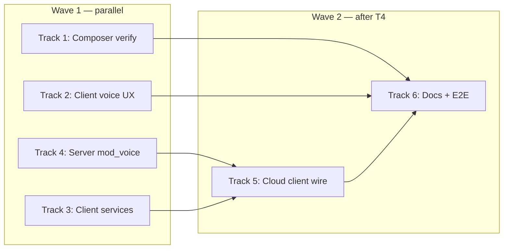

# Voice (TTS + STT) Implementation Plan

> **For agentic workers:** REQUIRED SUB-SKILL: Use superpowers:subagent-driven-development (recommended) or superpowers:executing-plans to implement this plan task-by-task. Steps use checkbox (`- [ ]`) syntax for tracking.

**Goal:** Ship cs_bots-parity voice UX (composer mic, read-aloud context menu, auto-speak toggle) with three engine modes (`local`, `web`, `cloud`), where `cloud` runs on the server, bills the user via the standard reserve → settle flow, and returns audio/transcript to the client.

**Architecture:** Client keeps `SttService` / `TtsService` as the single API. Engine choice comes from `VoicePrefs.sttEngine` / `VoicePrefs.ttsEngine` (`web` | `local` | `cloud`). `web` uses the same public Chromium/Google endpoints as `D:\cs_bots`. `local` uses `record` + `flutter_tts`. `cloud` calls new server RPCs in `mod_voice`, which gate with `billing_gate_with_hold`, proxy to Google Cloud Speech/TTS (or equivalent), log `cost_usd` to `ai.log`, and settle the reservation. Composer layout fixes stay in a separate track and do not block voice work.

**Tech Stack:** Flutter (`record`, `flutter_tts`, `audioplayers`), Rust (`mod_billing`, new `mod_voice`), Protobuf wire, YB `ai.log` + `ai.billing_reservation`.

## Global Constraints

- Read [`spec.md`](../../spec.md) and [`_/docs/billing.md`](../../_/docs/billing.md) before billing changes.
- Naming: `voice_stt`, `voice_tts`, `voice_*` RPCs; client methods `sttTranscribe`, `ttsSpeak`.
- IDs: ULID/string `req_id` per voice request for billing dedupe.
- Friendly errors in UI; technical detail in server log only.
- Verify: `flutter analyze` + `flutter test` (Dart), `cargo build -p server_ai` + `cargo test -p c35_mod_voice` (Rust).
- Do not commit secrets; cloud API keys live in cluster secret/env only.

---

## File map

| Area | Files |
|------|-------|
| Composer layout (done, verify) | `clients/app/lib/widgets/ai/in_composer.dart` |
| Client STT | `clients/app/lib/c/stt/stt_service.dart`, `stt_mic_permission.dart` |
| Client TTS | `clients/app/lib/c/tts/tts_service.dart`, `speech_lang.dart` |
| Voice prefs / settings | `clients/app/lib/c/settings/voice_prefs.dart`, `pages/page_settings.dart` |
| Context menu + Home | `widgets/ai/ui_msg_context_menu.dart`, `pages/page_ai_home.dart` |
| Speak toggle shell | `widgets/ui/ui_speak_toggle.dart`, avatar menu wiring |
| Client voice API | **Create** `clients/app/lib/c/voice/voice_api.dart` |
| Proto | **Create** `_/schemas/proto/c35/voice.proto`; regen pb |
| Server voice | **Create** `servers/crates/mod_voice/` |
| Billing constants | `servers/crates/mod_billing/src/billing_cost.rs` |
| Wire handler | `servers/crates/mod_identity` or `server_ai` invoke router |
| Docs | **Create** `_/docs/voice.md`; update `_/docs/README.md` |

**Reference (copy behavior, not import):** `D:\cs_bots/clients/app/lib/core/stt/stt_service.dart`, `core/tts/tts_service.dart`, `widgets/ai/ui_msg_context_menu.dart`, `pages/chat/page_chat.dart` (`onSpeak`, `speakEnabled`).

---

## Parallel waves



| Track | Owner focus | Blocked by |
|-------|-------------|------------|
| **1** Composer layout | Verify focus + spacing fixes already in `in_composer.dart` | — |
| **2** Client voice UX | Read aloud menu, auto-speak, speak toggle in shell | — |
| **3** Client services | Engine router (`web`/`local`/`cloud` stub) | — |
| **4** Server `mod_voice` + billing | Proto, reserve/settle, Google proxy | — |
| **5** Cloud client integration | `voice_api.dart` → server RPC | Track 4 |
| **6** Docs + tests | `voice.md`, widget tests | Tracks 1–5 |

---

### Track 1: Composer layout verify

**Files:**
- Modify: `clients/app/lib/widgets/ai/in_composer.dart`
- Test: manual + `flutter analyze`

**Interfaces:**
- Produces: stable `_inputArea` (TextField always under `Row → Expanded`); stacked bottom row with `top: 4` gap.

- [ ] **Step 1:** Hot-restart app; type until text wraps — confirm focus stays, caret visible, typing continues.
- [ ] **Step 2:** Narrow window &lt; 300px — confirm attach/model/send move to bottom row with gap above controls.
- [ ] **Step 3:** Run `cd clients/app; flutter analyze lib/widgets/ai/in_composer.dart`
- [ ] **Step 4:** If focus still drops, add post-frame `_focus.requestFocus()` in `onChanged` as safety net (only if Step 1 fails).

---

### Track 2: Client voice UX (cs_bots parity)

**Files:**
- Modify: `clients/app/lib/pages/page_ai_home.dart`
- Modify: `clients/app/lib/widgets/ai/ui_msg_context_menu.dart` (no change if menu API already supports `onSpeak`)
- Modify: `clients/app/lib/pages/page_settings.dart` (engine picker: web / local / cloud)
- Modify: avatar menu / shell — wire `UiSpeakToggleRow` (see `cs_bots` `ui_profile_menu.dart`)
- Create: `clients/app/lib/widgets/ai/ui_speak_indicator.dart` (optional — mic/recording pulse near composer)
- Test: `clients/app/test/voice_ux_test.dart`

**Interfaces:**
- Consumes: `TtsService.instance.speak(text)`, `VoicePrefs.instance.speakEnabled`
- Produces: `onSpeak` wired in `_threadContextMenu`; auto-speak on assistant message complete

- [ ] **Step 1: Wire read-aloud in context menu**

In `page_ai_home.dart` `_threadContextMenu`, pass `onSpeak` for assistant messages with text:

```dart
onSpeak: !isUser && plain.isNotEmpty
    ? () {
        ContextMenuController.removeAny();
        unawaited(TtsService.instance.speak(plain));
      }
    : null,
```

- [ ] **Step 2: Auto-speak after assistant reply**

In the prompt-end handler (where `_store` appends assistant `MsgRow`), mirror cs_bots `page_chat.dart`:

```dart
if (VoicePrefs.instance.speakEnabled && assistantText.trim().isNotEmpty) {
  unawaited(TtsService.instance.speak(assistantText));
}
```

Also call `TtsService.instance.stop()` when user sends a new message (interrupt playback).

- [ ] **Step 3: Speak toggle in avatar menu**

Add `UiSpeakToggleRow` to the account menu (same pattern as `page_settings.dart` / cs_bots profile menu). Persist via `VoicePrefs.setSpeakEnabled`.

- [ ] **Step 4: Settings — engine pickers**

Extend voice settings section:
- **STT engine:** `web` (default) | `local` (same as web on desktop) | `cloud` (billed)
- **TTS engine:** `web` (default) | `local` (`flutter_tts`) | `cloud` (billed)

Show caption when `cloud` selected: “Uses Alien AI cloud voice — charged to your balance.”

- [ ] **Step 5: Widget test**

```dart
test('context menu includes Read aloud when onSpeak provided', () {
  final items = msgBubbleMenuItems(
    // ... fake context via test helper
    plainText: 'Hello',
    onSpeak: () {},
    viewerIsRoot: false,
    isAssistant: true,
    reqId: '',
  );
  expect(items.any((i) => i is ChatMessageMenuAction && (i as ChatMessageMenuAction).label == 'Read aloud'), isTrue);
});
```

- [ ] **Step 6:** `flutter analyze` + `flutter test test/voice_ux_test.dart`

---

### Track 3: Client voice services (engine router)

**Files:**
- Modify: `clients/app/lib/c/stt/stt_service.dart`
- Modify: `clients/app/lib/c/tts/tts_service.dart`
- Create: `clients/app/lib/c/voice/voice_api.dart`
- Test: `clients/app/test/stt_service_test.dart`, `clients/app/test/tts_service_test.dart`

**Interfaces:**
- Produces:
  - `VoiceApi.sttTranscribe({required Uint8List audio, required String mime, String? lang}) → Future<String?>`
  - `VoiceApi.ttsSynthesize({required String text, String? lang}) → Future<({Uint8List bytes, String mime})?>`
  - `SttService.stopAndTranscribe` delegates to engine router
  - `TtsService.speak` delegates to engine router

- [ ] **Step 1: Windows recording fix (already partially done)**

Ensure `_recordingFormats()` tries WAV first on Windows with fallback loop (port from current c35 fix). Match cs_bots public endpoint for `web` path.

- [ ] **Step 2: Create `voice_api.dart` stub**

```dart
class VoiceApi {
  VoiceApi(this._conn);
  final ChatConn _conn;

  Future<String?> sttTranscribe({
    required Uint8List audio,
    required String mime,
    String? lang,
    String? reqId,
  }) async {
    final req = ReqVoiceStt()
      ..audio = audio
      ..mime = mime
      ..lang = lang ?? VoicePrefs.instance.speechLang
      ..reqId = reqId ?? Ulid().toString();
    final res = await _conn.invoke(req);
    return res is ResVoiceStt ? res.text : null;
  }

  Future<({Uint8List bytes, String mime})?> ttsSynthesize({
    required String text,
    String? lang,
    String? reqId,
  }) async { /* ReqVoiceTts → ResVoiceTts */ }
}
```

- [ ] **Step 3: Router in `SttService.stopAndTranscribe`**

```dart
final engine = VoicePrefs.instance.sttEngine;
if (engine == 'cloud') {
  // requires ChatConn — inject via setter or callback from page_ai_home
  return await _cloudStt(bytes, mime, lang);
}
return await _transcribeWebEndpoint(bytes, lang, mime);
```

- [ ] **Step 4: Router in `TtsService.speak`**

```dart
if (engine == 'cloud') {
  final audio = await _cloudTts(spoken, effectiveLang);
  if (audio != null) { await _audioPlayer!.play(BytesSource(audio.bytes)); return; }
}
// existing web → local fallback
```

- [ ] **Step 5: Inject `VoiceApi` from `page_ai_home`**

`SttService.instance.bindConn(_conn)` / `TtsService.instance.bindVoiceApi(VoiceApi(_conn))` in `initState`; clear on dispose.

- [ ] **Step 6:** Unit tests for engine selection (mock `VoicePrefs`, no network).

---

### Track 4: Server `mod_voice` + billing

**Files:**
- Create: `_/schemas/proto/c35/voice.proto`
- Create: `servers/crates/mod_voice/Cargo.toml`, `src/lib.rs`, `src/stt.rs`, `src/tts.rs`, `src/billing.rs`
- Modify: `servers/crates/mod_billing/src/billing_cost.rs`
- Modify: `servers/Cargo.toml`, `server_ai` invoke router
- Modify: `servers/crates/proto/build.rs` if needed
- Test: `servers/crates/mod_voice/tests/voice_billing_test.rs`

**Interfaces:**
- Produces:
  - `voice_stt(pool, owner_iid, req_id, audio, mime, lang) -> Result<String>`
  - `voice_tts(pool, owner_iid, req_id, text, lang) -> Result<(bytes, mime)>`
  - Constants: `VOICE_STT_HOLD_USD = 0.01`, `VOICE_TTS_HOLD_USD = 0.01` (tune in `billing_cost.rs`)
  - Retail: `VOICE_STT_USD_PER_MIN = 0.006`, `VOICE_TTS_USD_PER_1K_CHARS = 0.004` (× `RETAIL_MARKUP`)

**Proto (`voice.proto`):**

```protobuf
syntax = "proto3";
package c35;

message ReqVoiceStt {
  bytes audio = 1;
  string mime = 2;
  string lang = 3;
  string req_id = 4;
}
message ResVoiceStt {
  string text = 1;
  string error = 2;
}
message ReqVoiceTts {
  string text = 1;
  string lang = 2;
  string req_id = 3;
}
message ResVoiceTts {
  bytes audio = 1;
  string mime = 2;
  string error = 3;
}
```

- [ ] **Step 1: Add billing constants**

In `billing_cost.rs`:

```rust
pub const VOICE_STT_HOLD_USD: f64 = 0.01;
pub const VOICE_TTS_HOLD_USD: f64 = 0.01;
pub const VOICE_STT_USD_PER_MIN: f64 = 0.006;
pub const VOICE_TTS_USD_PER_1K_CHARS: f64 = 0.004;
```

- [ ] **Step 2: `voice_billing_gate`**

Mirror `billing_gate_with_hold` but with `hold_amounts(VOICE_*_HOLD_USD, ...)` and custom `req_id` prefix `voice_stt_` / `voice_tts_`. On failure return friendly `quota_rejection_reason`.

- [ ] **Step 3: Google Cloud proxy (server-side)**

Env vars: `GOOGLE_CLOUD_API_KEY` or service account JSON (cluster secret).

- **STT:** `POST https://speech.googleapis.com/v1/speech:recognize` with `encoding` from mime (LINEAR16 for wav, OGG_OPUS for ogg).
- **TTS:** `POST https://texttospeech.googleapis.com/v1/text:synthesize` → base64 audio.

Compute wholesale cost from duration/chars; retail = `billing_to_retail_usd(wholesale)`.

- [ ] **Step 4: Reserve → call → settle**

```rust
pub async fn voice_stt(pool, owner_iid, req_id, audio, mime, lang) -> Result<String> {
    let brow = billing_account_ensure(pool, owner_iid).await?;
    billing_gate_with_hold_custom(pool, owner_iid, &brow, req_id, VOICE_STT_HOLD_USD).await?;
    let text = google_stt(audio, mime, lang).await?;
    let cost = estimate_stt_cost_usd(audio.len(), mime);
    billing_reservation_settle(pool, req_id, cost, owner_iid, "voice_stt").await?;
    log_put(/* ai.log row, cost_usd */);
    Ok(text)
}
```

On API error: `billing_reservation_refund(pool, req_id)`.

- [ ] **Step 5: Wire RPC in server invoke handler**

Register `ReqVoiceStt` / `ReqVoiceTts` alongside existing chat RPCs; auth = session `owner_iid`.

- [ ] **Step 6: Tests**

```rust
#[tokio::test]
async fn voice_stt_refunds_on_empty_audio() { /* ... */ }
#[tokio::test]
async fn voice_tts_rejects_over_quota() { /* mock pool */ }
```

- [ ] **Step 7:** `cargo test -p c35_mod_voice` + `cargo build -p server_ai`

---

### Track 5: Cloud client integration (after Track 4)

**Files:**
- Modify: `clients/app/lib/c/voice/voice_api.dart` (remove stub)
- Modify: `clients/app/lib/c/pb/c35/voice.pb.dart` (generated)
- Modify: `clients/app/lib/c/stt/stt_service.dart`, `c/tts/tts_service.dart`

- [ ] **Step 1:** Regenerate protobuf (`ReqVoiceStt` / `ResVoiceTts` in Dart).
- [ ] **Step 2:** Implement `VoiceApi` with `_conn.invoke`.
- [ ] **Step 3:** Surface billing errors via `ui_friendly_error` snackbar (“Not enough balance for cloud voice”).
- [ ] **Step 4:** Manual E2E: set TTS engine = cloud → context menu Read aloud → hear audio, balance decreases in settings.

---

### Track 6: Docs + final verification

**Files:**
- Create: `_/docs/voice.md`
- Modify: `_/docs/README.md`, `_/docs/billing.md` (one paragraph: voice metered SKU)

**`voice.md` sections:**
1. Engines (`web` / `local` / `cloud`)
2. Client services (`SttService`, `TtsService`, `VoiceApi`)
3. Server RPC + billing flow (reserve/hold/settle diagram)
4. Pricing constants + where to change them
5. Cluster secrets (`GOOGLE_CLOUD_API_KEY`)
6. cs_bots parity checklist (context menu, auto-speak, composer mic)

- [ ] **Step 1:** Write `voice.md`.
- [ ] **Step 2:** Full verify:

```powershell
cd clients/app; flutter analyze; flutter test
cd servers; cargo test -p c35_mod_voice; cargo build -p server_ai
```

---

## Billing flow (cloud)

```
Client                    Server                         Google API
  |  ReqVoiceTts(req_id)    |                                |
  | ----------------------> | billing_gate_with_hold         |
  |                         | (escrow VOICE_TTS_HOLD_USD)    |
  |                         | ------------------------------>|
  |                         |        audio bytes             |
  |                         | <------------------------------|
  |                         | billing_reservation_settle     |
  |                         | log_put(cost_usd)              |
  |  ResVoiceTts(audio)     |                                |
  | <---------------------- |                                |
```

Same shape for STT with `ReqVoiceStt`. `req_id` must be unique per request (ULID). Reuse `billing_usage_dedupe` if the same `req_id` is retried.

---

## Pricing (initial — adjust in `billing_cost.rs`)

| SKU | Hold | Meter |
|-----|------|-------|
| Cloud STT | $0.01 | $0.006 / minute (retail) |
| Cloud TTS | $0.01 | $0.004 / 1k chars (retail) |

`web` / `local` engines: **$0** — no server call, no reservation.

---

## Spec coverage self-check

| Requirement | Track |
|-------------|-------|
| Composer focus on multiline | 1 |
| Composer bottom-row controls | 1 |
| Read aloud context menu | 2 |
| Auto-speak toggle | 2 |
| Composer mic (STT) | 1 + 3 |
| Public web STT/TTS (cs_bots) | 3 |
| Cloud STT/TTS | 4 + 5 |
| Reserve before call | 4 |
| Settle/refund on result | 4 |
| User balance deduct | 4 |
| Docs | 6 |

---

## Execution handoff

**Wave 1 (dispatch now, parallel):** Tracks 1, 2, 3, 4 as separate subagents.

**Wave 2 (after Track 4 merges):** Tracks 5, 6.
