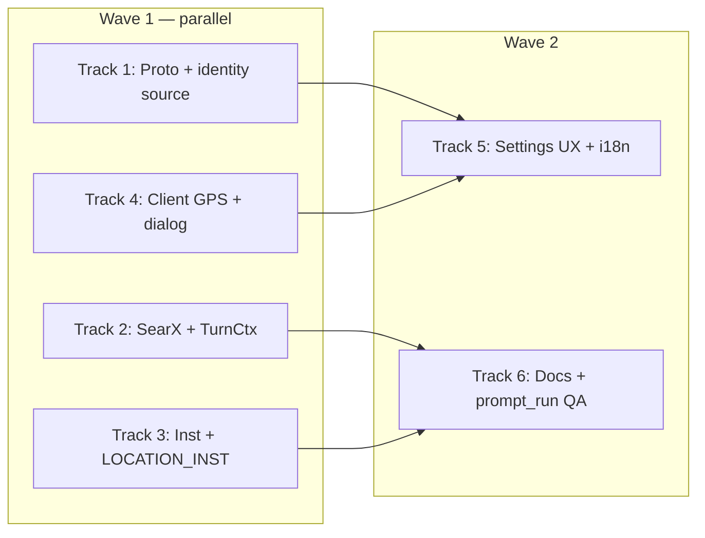

# Location access + prompt + SearXNG locale Implementation Plan

> **For agentic workers:** REQUIRED SUB-SKILL: Use superpowers:subagent-driven-development (recommended) or superpowers:executing-plans to implement this plan task-by-task. Steps use checkbox (`- [ ]`) syntax for tracking.

**Goal:** Let users opt in to device location (with rationale dialog), fall back to IP geo when declined, surface location in AI instructions, and make `web.search` (SearXNG) use that context via locale + model steering.

**Architecture:** Client reverse-geocodes GPS to city/region/country and syncs through existing `ReqSessionInit` / `UserLocalePrefs`. Server already backfills from Cloudflare headers when location is empty (`identity_geo_ip_apply`). Prompt turns already prepend `[USER LOCATION]` when `location_city` is set; extend inst seeds and pass location into `TurnCtx` so `web_search_exec` sends SearXNG `language` (e.g. `id-ID`). No raw lat/lng on the wire to the LLM unless we add a maps tool later.

**Tech Stack:** Flutter (`geolocator`, `geocoding`, `permission_handler`), Rust (`mod_identity`, `mod_chat` tools/web), Protobuf `session.proto`, YB `identity.meta.location`, SearXNG HTTP API, `ai.inst` seeds.

## Global Constraints

- Read [`spec.md`](../../spec.md), [`_/docs/inst.md`](../../_/docs/inst.md), [`_/docs/prompt-steering.md`](../../_/docs/prompt-steering.md) before inst/compose changes.
- Inst steering: prefer **Type B** (`ai.inst` seeds); do not add new hardcoded tool-steering in Rust beyond existing `location_prompt_block` / `LOCATION_INST` unless migrating that block to inst in the same change.
- Naming: `locationPermissionEnsure`, `locationServiceResolve`, `userLocationPrefs`; server `location_source` values `device` | `ip` | `user`.
- Verify: `flutter analyze` + targeted widget tests (Dart); `cargo build -p server_ai` + `cargo test -p c35_mod_chat` (Rust).
- `prompt_compose` / `prompt_run` with `owner_iid: 99000` for weather/cinema phrases after inst changes (see `prompt-run-test.mdc`).
- Do **not** raise `appReleaseMinBuild` for this feature (backward-compatible API + prefs).

---

## Current baseline (do not re-build)

| Piece | Status |
|-------|--------|
| `identity_geo_from_headers` + `identity_geo_ip_apply` on `session_init` | Done (`mod_identity`) |
| `location_prompt_block` in system prompt | Done (`mod_chat/prompt/time.rs`) |
| Manual city/region/country in Settings | Done (`page_settings.dart`) |
| `web.search` → SearXNG `q` + `format=json` only | Done (`mod_chat/src/tools/web.rs`) |
| Device GPS permission UI | **Missing** |

---

## File map

| Area | Files |
|------|-------|
| **Client — permission** | **Create** `clients/app/lib/c/location/location_permission.dart` (mirror `stt_mic_permission.dart`) |
| **Client — resolve** | **Create** `clients/app/lib/c/location/location_service.dart` (geolocate + reverse geocode) |
| **Client — prefs** | **Create** `clients/app/lib/c/location/user_location_prefs.dart` (`asked`, `useDevice`, last source) |
| **Client — UI** | **Create** `clients/app/lib/widgets/settings/ui_location_consent_dialog.dart`; modify `page_settings.dart` |
| **Client — wire** | Modify `chat_store.dart` / session bootstrap to call location flow + `sessionInit` |
| **Client — platform** | `android/app/src/main/AndroidManifest.xml`, `ios/Runner/Info.plist`, `pubspec.yaml` |
| **Client — i18n** | `assets/translations/en.json`, `id.json` |
| **Proto** | Modify `_/schemas/proto/c35/session.proto` (`location_source` on `ReqSessionInit`); regen pb |
| **Server — identity** | `identity_prefs_sync.rs`, `session_init.rs` |
| **Server — tools** | `mod_chat/src/tools/web.rs`, `web_search.rs`, `web_research.rs`, `tools/mod.rs` (`TurnCtx`) |
| **Server — prompt** | `prompt_turn.rs`, `channel_prompt_turn.rs` (populate `TurnCtx` location) |
| **Inst** | `_/schemas/inst.sql` (+ cluster apply / `inst_put` if prod uses live DB only) |
| **Docs** | **Create** `_/docs/location.md`; link from `_/docs/README.md` |

---

## Design decisions (locked)

### 1. Permission UX

1. Show **in-app** dialog first (not OS sheet).
2. **Continue** → request OS location (Android/iOS only).
3. **Not now** → persist `asked=true`, rely on server IP geo on next `session_init` with empty location fields.
4. Show dialog when: logged in, `location_city` empty, `!userLocationPrefs.asked`, and not on web/desktop (desktop skips dialog; IP + Settings only).

**Copy (EN — localize ID):**

- **Title:** Use your location?
- **Body:** Alien AI can use your approximate location to suggest nearby places, local weather, and events where you are. We use it only to personalize answers—not to track you in the background. You can change or turn this off anytime in Settings.
- **Primary:** Continue
- **Secondary:** Not now

After OS deny: snackbar — “Using approximate location from your network. Set your city in Settings if this looks wrong.”

### 2. `location.source` in `identity.meta`

| Source | When |
|--------|------|
| `device` | Client synced from GPS reverse-geocode |
| `ip` | Server `identity_geo_ip_apply` (unchanged) |
| `user` | Manual Settings edit (unchanged) |

**Precedence:** `user` wins over `device`/`ip` on sync (already enforced for `ip`; extend `identity_geo_ip_apply` to skip when source is `user` **or** `device`).

Add `location_source` on `ReqSessionInit` (string, optional). When client sends non-empty city **and** `location_source=device`, set meta `location.source` to `device`. When client sends manual save from Settings, send `user`.

### 3. Instructions (three layers — all updated)

| Layer | Change |
|-------|--------|
| **System block** | Tighten `LOCATION_INST` in `time.rs`: mention web.search should use this city for local weather/nearby/cinema when user does not name another place. |
| **Inst seed** | Update `inst.web_search`: “When [USER LOCATION] is set and the question is local (weather, bioskop, ‘near me’), include that city/region in the `query` unless the user named a different place.” |
| **Optional** | New `inst.user_location` task with phrases `['cuaca', 'nearby', 'terdekat', 'di sekitar']` — only if compose tests show model ignores system block; try inst.web_search first. |

Do **not** duplicate a fourth persona in `identity.meta_json.inst_base`.

### 4. SearXNG “location aware”

SearXNG has **no lat/lng API**. Location-aware search = **(A)** `language` locale tag (`id-ID`, `en-US`) derived from `location_country` + user `locale`, and **(B)** model query includes city (inst steering). Server always applies (A); (B) is inst.

**Implement in `web_search_exec`:**

```text
/search?q=...&format=json&categories=general&language={searx_locale}
```

Add `searx_language_tag(country, locale) -> String`:

- `ID` + locale `id*` → `id-ID`
- `ID` else → `id-ID` if country ID
- `SG` → `en-SG`, `MY` → `ms-MY` or `en-MY`, default `en-US` / `all` per SearX config

Pass `SearchGeoContext { city, region, country, locale }` from `TurnCtx` into `web_search_exec`. Include `search_language` in JSON tool response for trace/debug.

**Do not** silently append city to `q` server-side (breaks explicit “weather in Tokyo”); optional future flag `local_hint: true` on tool args if needed.

---

## Parallel waves



| Track | Focus | Blocked by |
|-------|--------|------------|
| **1** | `location_source` proto + SQL sync + geo apply guard | — |
| **2** | `TurnCtx` location + `web_search_exec` language param + tests | — |
| **3** | `inst.sql` + `LOCATION_INST` text | — |
| **4** | Flutter geolocator, consent dialog, session bootstrap | — |
| **5** | Settings: show source, “Use device location” toggle, re-prompt | 1, 4 |
| **6** | `location.md`, `prompt_run` verification | 2, 3 |

---

### Track 1: Proto + identity `location_source`

**Files:** `_/schemas/proto/c35/session.proto`, `identity_prefs_sync.rs`, `identity_geo.rs`, `session_init.rs`, regen `clients/app/lib/c/pb/**`

- [ ] Add `string location_source = 13;` to `ReqSessionInit` (next free field — verify proto field numbers).
- [ ] Extend `identity_prefs_sync(..., location_source: &str)`:
  - If city/region/country non-empty and source is `device` or `user`, write `location.source` accordingly.
- [ ] Update `identity_geo_ip_apply`: skip when `meta #>> '{location,source}'` IN (`user`, `device`).
- [ ] `session_init`: pass `req.location_source` into prefs sync.
- [ ] Unit tests in `identity_geo.rs` / new test for prefs sync source `device`.
- [ ] `cd servers && cargo build -p server_ai && cargo test -p c35_mod_identity`

---

### Track 2: SearXNG locale + TurnCtx

**Files:** `tools/mod.rs`, `tools/web.rs`, `tools/builtin/web_search.rs`, `prompt_turn.rs`, `channel_prompt_turn.rs`, `prompt/tool_loop.rs` (no change if uses `cluster_tool_exec` only)

- [ ] Add to `TurnCtx`: `location_city`, `location_region`, `location_country` (or nested `UserPromptContext` clone).
- [ ] `prompt_turn.rs`: after `user_prompt_context_get`, copy location into `TurnCtx`.
- [ ] `fn searx_language_tag(country: &str, locale: &str) -> String` in `web.rs` + tests.
- [ ] `web_search_exec(client, query, limit, geo: Option<&SearchGeoContext>)` — append `&language=...` when tag non-empty.
- [ ] `WebSearchTool` execute closure: build geo from `ctx` (tool macro must expose TurnCtx — follow `ConsumptionTodayTool` pattern).
- [ ] `web_research.rs`: pass same geo into `web_search_exec`.
- [ ] `cargo test -p c35_mod_chat` (add tests for URL encoding / language tag).

---

### Track 3: Inst + system location instruction

**Files:** `_/schemas/inst.sql`, `mod_chat/src/prompt/time.rs`

- [ ] Update `LOCATION_INST` (one sentence on web.search + local queries).
- [ ] Update `inst.web_search` inst body (local query + city from user location block).
- [ ] Apply seeds to dev DB; use `inst_put` MCP or migration script per env practice.
- [ ] Extend `compose_test.rs` if needed (optional phrase “cuaca hari ini” still matches `inst.web_search`).
- [ ] `prompt_compose` text: `cuaca hari ini` / `jadwal bioskop` with owner 99000 — confirm `inst.web_search` matched.

---

### Track 4: Client — GPS, consent, session

**Files:** `pubspec.yaml` (`geolocator`, `geocoding`), manifests, new `c/location/*`, `chat_store.dart` or app init

- [ ] `location_permission.dart`: Android/iOS request; Windows/Linux/macOS desktop → return false (no-op).
- [ ] `location_service.dart`: `locationResolveOnce()` → `{city, region, country}` or null; timeout 12s; coarse accuracy OK.
- [ ] `user_location_prefs.dart`: keys `location_asked`, `location_use_device`.
- [ ] Consent dialog widget; show from post-login hook once.
- [ ] On grant: resolve → `UserLocalePrefs.set` → `sessionInit(..., locationSource: 'device')`.
- [ ] On deny: `sessionInit` with empty location (IP path).
- [ ] `flutter analyze`

---

### Track 5: Settings UX

**Files:** `page_settings.dart`, translations

- [ ] Section **Location**: show city/region/country (existing), add subtitle: “Source: Device / Network / Manual” from profile meta if exposed on `IdentityProfile` (else client tracks last sync source).
- [ ] Optional: **Use device location** switch → re-run permission + resolve.
- [ ] Link to OS app settings when permission permanently denied.
- [ ] Manual edit sets `location_source: user` on next sync.

**Proto note:** If profile does not expose `location.source`, add optional `location_source` on `IdentityProfile` in `identity.proto` (read-only) — small follow-up in Track 1.

---

### Track 6: Docs + E2E verification

**Files:** `_/docs/location.md`, `_/docs/README.md`

- [ ] Document permission flow, fallback order: **device → user manual → ip**, privacy.
- [ ] Document SearX `language` param behavior.
- [ ] **prompt_run** (99000): `cuaca hari ini` — trace shows `web.search`, response uses local context; inspect `trace.tool` meta / search result `search_language`.
- [ ] **prompt_run**: `jadwal bioskop malang` — unchanged or better with `id-ID`.
- [ ] Manual: Android grant/deny dialog; Settings override.

---

## Testing matrix

| Case | Expected |
|------|----------|
| Fresh user, deny GPS | `location.source=ip`, city from CF headers, prompt has location block if city non-empty |
| Grant GPS Malang | `source=device`, city Malang, SearX `language=id-ID` |
| Manual Jakarta in Settings | `source=user`, geo IP does not overwrite |
| “cuaca hari ini” | `web.search` called; query includes Malang/Jakarta per inst |
| “weather in Tokyo” | Query must **not** force user city into `q` (model uses Tokyo) |

---

## Out of scope (YAGNI)

- Continuous background location updates
- Storing lat/lng in YB
- SearXNG engine-specific `near:` operators (fragile across engines)
- Web client geolocation API (separate track)

---

## Rollout

1. Deploy server (proto backward compatible — empty `location_source` OK).
2. Ship app with dialog; no `min` bump.
3. Apply `inst.sql` updates on cluster DB.
4. Monitor `ai.log` tool rows for `web.search` errors / empty results after `language=` change; rollback by omitting param via env `SEARX_LANGUAGE=` empty disable if needed.
