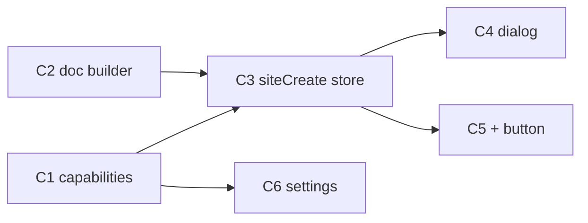

# Site Create Dialog (+) — Multitask Implementation Plan

> **For agentic workers:** REQUIRED SUB-SKILL: Use superpowers:subagent-driven-development (recommended) or superpowers:executing-plans to implement this plan task-by-task. Steps use checkbox (`- [ ]`) syntax for tracking.

**Goal:** Add a **Sites page + button** that opens a create dialog (logo, name, alien_id, tagline with generate, feature checklist) and provisions a new site using existing RPCs — no schema migration, no CSA editor UI port.

**Architecture:** **Flutter-only** create flow: `identity_put` → `site_config_put` → `site_draft_put` with a minimal hero `SiteDoc`. Feature toggles map to `site.config.capabilities_json` (`commerce`, `booking`, `queue`, `attendance`). Tagline generation is **client-side templates** (CSA-like UX, no LLM v1). POS and Product share `commerce`; UI enforces POS ⇒ Product. Create stays **draft-only** (no auto-publish).

**Tech Stack:** Flutter `clients/app` (`page_sites`, `site_store`, new `in_site_create` / `ui_site_add_menu`), existing WS RPCs in `chat_conn.dart`. Specs: [`spec.md`](../../spec.md), [`_/specs/site.md`](../../_/specs/site.md), [`_/specs/ui.md`](../../_/specs/ui.md).

## Global Constraints

- **No YSQL / proto migration** for this plan — use existing `ai.identity`, `site.config`, `site.draft`.
- **No new server RPC** required (optional Track S1 deferred).
- Guest URLs: `https://alienai.id/{alien_id}/…` — alien_id required on create.
- Layout editing stays **Home prompt** (`web.builder`); create dialog only bootstraps identity + config + stub draft.
- **Attendance** checkbox stores `capabilities_json.attendance` only — no HR/presence module in this plan.
- **Reservasi** → `booking: true` (Objects tab + booking blocks already gated server-side).
- **Product / POS** → `commerce: true` (Products + Orders/POS tooling).
- **`queue: false`** on create unless user enables later in Settings.
- Naming: `in_` input dialogs, `ui_` widgets; `siteCreate` on store; `l()` / `lError()`.
- Verify: `cd clients/app && flutter analyze`; run `flutter test` for new unit/widget tests.
- Do not commit unless user asks.

## Out of Scope

| Item | Why |
|------|-----|
| Auto-publish on create | Draft preview sufficient; user publishes from Settings |
| LLM tagline RPC | v1 = template `siteTaglineSuggest` |
| Atomic `site_create` server handler | Optional hardening (Track S1) |
| Attendance / reservation product features | Flags only; modules later |
| Porting CSA 3-pane site editor | Locked out in `site.md` |

---

## Capability Mapping (locked for this plan)

| UI label | JSON key | Server / UI effect today |
|----------|----------|---------------------------|
| Product | `commerce` | `site.product` tab; commerce tools |
| POS | `commerce` (same) | Same; UI ties POS → Product |
| Attendance | `attendance` | Stored only (default parse: off when absent on create) |
| Reservasi | `booking` | `site.object` tab; booking blocks in render |
| (implicit) | `queue: false` | Queue blocks off until Settings |

---

## File Map

| File | Action |
|------|--------|
| `clients/app/lib/c/site/site_capabilities.dart` | **Create** — parse/encode, UI ↔ JSON, create defaults |
| `clients/app/lib/c/site/site_create_doc.dart` | **Create** — `siteCreateDoc(...)`, `siteTaglineSuggest`, `siteAlienIdSlug` |
| `clients/app/lib/c/site/site_store.dart` | **Modify** — `siteCreate(...)`, optional rollback |
| `clients/app/lib/widgets/sites/in_site_create.dart` | **Create** — dialog UI |
| `clients/app/lib/widgets/sites/ui_site_add_menu.dart` | **Create** — + menu on master bar |
| `clients/app/lib/pages/page_sites.dart` | **Modify** — wire `UiSiteAddMenu` on `UiSearchToggle.trailing` |
| `clients/app/lib/c/site/site_table_rows.dart` | **Modify** — delegate to `site_capabilities.dart` or extend keys |
| `clients/app/lib/widgets/sites/ui_site_detail.dart` | **Modify** (optional W4) — friendly capability labels + `attendance` toggle |
| `clients/app/test/site_capabilities_test.dart` | **Create** |
| `clients/app/test/site_create_doc_test.dart` | **Create** |

**Reference patterns:** `widgets/bots/in_bot_create.dart`, `widgets/devices/ui_device_add_menu.dart`, `pages/page_devices.dart`, `servers/crates/mod_site/examples/grosir_domain_setup.rs` (starter hero doc).

---

## Multitask Map

```
WAVE 1 — Shared client model (parallel)
  C1  site_capabilities.dart (keys, encode for create, POS↔Product rules)
  C2  site_create_doc.dart (slug, tagline suggest, SiteDoc builder)

WAVE 2 — Store orchestration (after C1+C2)
  C3  SiteStore.siteCreate + tests

WAVE 3 — UI (parallel after C3)
  C4  in_site_create.dart dialog
  C5  ui_site_add_menu + page_sites + bar

WAVE 4 — Polish (parallel)
  C6  Settings capability labels (optional)
  C7  Manual E2E checklist

DEFERRED
  S1  Server atomic site_create RPC + orphan cleanup
```

### Suggested agent assignments

| Agent | Track | Deliverable |
|-------|-------|-------------|
| A | C1 | Capability map + unit tests |
| B | C2 | Doc builder + slug/tagline tests |
| C | C3 | `siteCreate` RPC sequence + store test/mocks |
| D | C4 | Create dialog (logo picker, fields, checklist) |
| E | C5 | + button on Sites page |
| F | C6 | Settings tab alignment (if time) |
| G | C7 | E2E notes |

---

# WAVE 1

## Track C1 — `site_capabilities.dart`

**Files:**
- Create: `clients/app/lib/c/site/site_capabilities.dart`
- Create: `clients/app/test/site_capabilities_test.dart`
- Modify: `clients/app/lib/c/site/site_table_rows.dart` — re-export or thin wrapper to avoid duplicate `_capabilityKeys`

**Tasks:**

- [ ] **C1.1** Define keys: `commerce`, `booking`, `queue`, `attendance`.
- [ ] **C1.2** `siteCapabilitiesParse(String raw)` — keep Settings behavior: missing keys default **true** for legacy rows (existing tests if any).
- [ ] **C1.3** `siteCapabilitiesEncode(Map<String, bool> caps)` — all four keys explicit.
- [ ] **C1.4** `SiteCreateFeatures` class with bools: `product`, `pos`, `attendance`, `reservation`.
- [ ] **C1.5** `siteCreateFeaturesToJson(SiteCreateFeatures f)` → capabilities map:
  - `commerce = f.product || f.pos`
  - `booking = f.reservation`
  - `queue = false`
  - `attendance = f.attendance`
- [ ] **C1.6** `siteCreateFeaturesNormalize(SiteCreateFeatures f)` — if `pos` then `product = true`; if `!product` then `pos = false`.
- [ ] **C1.7** Unit tests: POS forces product; product off clears POS; reservation → booking; attendance independent.

**Acceptance:** `flutter test test/site_capabilities_test.dart` passes.

---

## Track C2 — `site_create_doc.dart`

**Files:**
- Create: `clients/app/lib/c/site/site_create_doc.dart`
- Create: `clients/app/test/site_create_doc_test.dart`

**Tasks:**

- [ ] **C2.1** `siteAlienIdSlug(String name)` — trim, lower, spaces → `-`, strip invalid chars, collapse `-`, max length ~48.
- [ ] **C2.2** `siteTaglineSuggest({required String name, required String locale})` — 4 templates (id-ID + en), pick by `name.hashCode % n` or round-robin; no network.
- [ ] **C2.3** `siteCreateDoc({required int siteIid, required String name, required String tagline, String pic = ''})` → `SiteDraft` with:
  - `SiteDoc`: one `SitePage` path `/`, title = name
  - `hero` block: `props_json` `{"title":name,"subtitle":tagline}` + optional `pic`
  - `theme_json`: `{"accent":"#2563eb"}` (match grosir example)
  - `meta_json`: `{"seo_title":name,"tagline":tagline}`
- [ ] **C2.4** Unit tests: slug edge cases; doc JSON contains hero + meta; empty tagline allowed.

**Acceptance:** `flutter test test/site_create_doc_test.dart` passes.

---

# WAVE 2

## Track C3 — `SiteStore.siteCreate`

**Files:**
- Modify: `clients/app/lib/c/site/site_store.dart`

**Tasks:**

- [ ] **C3.1** Add method:

```dart
Future<SiteRow> siteCreate({
  required String name,
  required String alienId,
  String pic = '',
  String tagline = '',
  required SiteCreateFeatures features,
  String locale = 'en',
})
```

- [ ] **C3.2** `await ensureConnected(locale: locale)`.
- [ ] **C3.3** `identityPut(ReqIdentityPut(iid: 0, kind: 'site', type: 'web', name:, alienId:, pic:))` — capture `siteIid` from `res.row.identity.iid`.
- [ ] **C3.4** On failure after identity created: optional `identityDelete(siteIid)` in catch (mirror bot create rollback pattern if present).
- [ ] **C3.5** `siteConfigPut(siteIid, capabilitiesJson: jsonEncode(siteCreateFeaturesToJson(normalized)))`.
- [ ] **C3.6** `siteDraftPut(siteCreateDoc(...), skipPublish: true)`.
- [ ] **C3.7** `refresh()` + `select(siteIid)` + return row from `rowById` or map from identity response.
- [ ] **C3.8** Propagate server errors (`alien_id taken`, validation) to UI.

**Acceptance:** Manual or mocked test: three RPCs called in order; `flutter analyze` clean.

---

# WAVE 3

## Track C4 — `in_site_create.dart`

**Files:**
- Create: `clients/app/lib/widgets/sites/in_site_create.dart`

**Tasks:**

- [ ] **C4.1** `Future<InSiteCreateResult?> inSiteCreateShow(BuildContext context, {required SiteStore store})` — `showDialog`, barrierDismissible false (match bot create).
- [ ] **C4.2** Layout ~400px: logo row (`UiUserAvatar` + pick image → upload → `_pic` URL — copy file pick + upload flow from `in_bot_create.dart`).
- [ ] **C4.3** Fields: Name (required), Alien ID (required, auto-fill from slug on name change, editable), Tagline (multiline).
- [ ] **C4.4** **Generate** button on tagline → `siteTaglineSuggest(name, AppLocale.current or context)`.
- [ ] **C4.5** Checklist section title “Fitur”:
  - Product
  - POS (onChanged: normalize features)
  - Attendance
  - Reservasi
- [ ] **C4.6** Validation: non-empty name/alien_id; alien_id regex `[a-z0-9_-]+`; show `alienai.id/{id}` hint.
- [ ] **C4.7** Create button → `store.siteCreate(...)` with loading state; on success `Navigator.pop` with `InSiteCreateResult(siteIid, name)`.
- [ ] **C4.8** Cancel dismisses without side effects.

**Acceptance:** Dialog opens from test harness or manual; checklist POS/Product rules work in UI.

---

## Track C5 — + button on Sites page

**Files:**
- Create: `clients/app/lib/widgets/sites/ui_site_add_menu.dart`
- Modify: `clients/app/lib/pages/page_sites.dart`

**Tasks:**

- [ ] **C5.1** `UiSiteAddMenu` — `PopupMenuButton` or single tap `Icons.add` (match `UiDeviceAddMenu` / `UiBotAddMenu` tooltip “Add site”).
- [ ] **C5.2** One item: “Create site” → `inSiteCreateShow`.
- [ ] **C5.3** On result: `store.select(result.siteIid.toString())` if not already selected in `siteCreate`.
- [ ] **C5.4** Wire into `_SiteMasterBar`: `UiSearchToggle(onSearch: store.searchPut, trailing: UiSiteAddMenu(store: store))`.
- [ ] **C5.5** Ensure `_boot` stays post-frame (already fixed) — do not call connect from `initState` sync path.

**Acceptance:** Sites master bar shows +; create flow lists new site; Preview shows draft hero (unpublished).

---

# WAVE 4

## Track C6 — Settings capabilities alignment (optional)

**Files:**
- Modify: `clients/app/lib/widgets/sites/ui_site_detail.dart`

**Tasks:**

- [ ] **C6.1** Import shared `site_capabilities.dart`.
- [ ] **C6.2** Add toggle for `attendance` with label “Attendance (coming soon)” or hide until module ships — **prefer show toggle** so create + Settings match.
- [ ] **C6.3** Optional copy: “Commerce” → split labels “Products” / note POS uses same switch, or single “Commerce (Products & POS)” to avoid duplicate toggles.

**Acceptance:** Site created with attendance off shows off in Settings; commerce off hides Products tab.

---

## Track C7 — Integration / E2E

**Tasks:**

- [ ] **C7.1** `flutter analyze` on `clients/app`.
- [ ] **C7.2** Manual: signed-in user → Sites → + → fill form → Create → site appears in list → Preview draft shows title/tagline.
- [ ] **C7.3** Manual: create with only Reservasi → Objects tab visible, Products hidden when commerce false.
- [ ] **C7.4** Manual: duplicate alien_id shows server error in dialog.
- [ ] **C7.5** Hint bundle: new site appears in avatar site count after refresh (identity row exists).

---

# DEFERRED — Track S1 (server atomic create)

Only if orphan `ai.identity` rows become a problem in production.

**Files:**
- Add: `servers/crates/mod_site/src/site_create.rs`
- Modify: `site.proto`, `wire.proto`, `session.rs`, `chat_conn.dart`

**Tasks:**

- [ ] **S1.1** `site_create` RPC: identity insert + config + draft in one transaction.
- [ ] **S1.2** Grant owner row if required by future RBAC audits.
- [ ] **S1.3** Flutter `siteCreate` calls single RPC.

---

## Dependency Graph



---

## Execution order (for parent agent)

1. Dispatch **C1** and **C2** in parallel (Wave 1).
2. Dispatch **C3** when C1+C2 merge (Wave 2).
3. Dispatch **C4** and **C5** in parallel (Wave 3).
4. Dispatch **C6** + **C7** (Wave 4).

---

## Risk Notes

| Risk | Mitigation |
|------|------------|
| Orphan identity if draft put fails | `identityDelete` in catch (C3.4) |
| `connected` false on Sites open | post-frame `_boot`; create uses `ensureConnected` |
| Settings parse defaults all true | Create uses explicit `siteCreateFeaturesToJson`; list new sites with fresh config row |
| Pic upload fails | Allow create without logo; empty `pic` |

---

*Plan version: 2026-09-26 — Site create dialog (+) multitask.*
