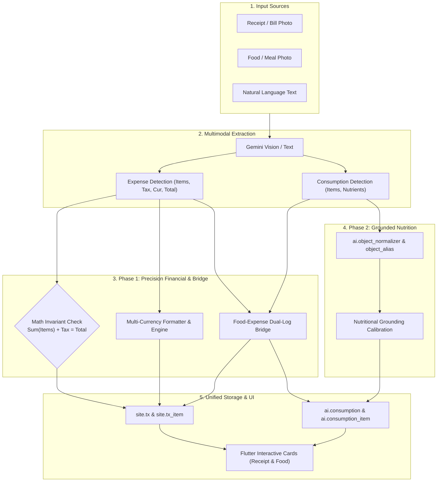

# SOTA Nutrition & Expense Tracking — Multitask Implementation Plan (Phases 1 & 2)

> **Status:** Pending Execution  
> **Date:** 2026-09-27  
> **Target Repo:** `d:\c35` (`servers/crates/mod_expense`, `servers/crates/mod_consumption`, `servers/crates/mod_chat`, `clients/app`)

---

## 1. Executive Summary & Goals

Transform c35's conversational nutrition and expense tracking into a **State-of-the-Art (SOTA)** system across two active phases, while locking future integrations (Barcode, HealthKit, Email, SMS) in architecture documentation:

1. **Phase 1: Precision Financial Reconciliation, Multi-Currency & Food-Expense Bridge**
   - **Receipt Invariant Validation**: Mathematical reconciliation check on all receipt OCR extractions ($\sum \text{items} - \text{discounts} + \text{tax} + \text{service} = \text{total}$). Flag mismatches in UI.
   - **Multi-Currency Support**: Expand beyond IDR to support global currencies (`USD`, `EUR`, `SGD`, `MYR`, `JPY`, etc.) with dynamic currency detection, ISO code tracking, and clean locale formatting.
   - **Single-Shot Food & Expense Bridge**: A restaurant bill or grocery receipt simultaneously records the financial transaction in `site.tx` and the nutritional meal log in `ai.consumption`, eliminating double entry.

2. **Phase 2: Grounded Nutrition Knowledge Base & Taxonomy Calibration**
   - **Knowledge Base Grounding via `ai.object_normalizer`**: Link food line items to canonical taxonomy nodes (`consumable.food.*`).
   - **Nutritional Grounding**: Calibrate zero-shot LLM estimates against verified nutritional reference baselines per 100g/serving.
   - **Enhanced Flutter Card UI**: Display verification badges (Verified vs Estimated), portion grams/calibrations, and discrepancy warnings.

3. **Documentation Updates (Deferred Roadmap)**:
   - Document Barcode (UPC/EAN) & Nutrition Label OCR and Apple HealthKit / Google Health Connect in [`_/specs/consumption.md`](../consumption.md).
   - Document E-Receipt forwarding via `mail.*` and Android SMS / bank push notification listeners in [`_/specs/tx.md`](../tx.md).

---

## 2. Architecture & Work Streams



---

## 3. Multitask Track Breakdown

### Track 0: Documentation & Deferred Roadmap (Immediate)
- Update [`_/specs/consumption.md`](../consumption.md):
  - Section on **Future Phase 3: Barcode & Label Scanner** (UPC/EAN scanner via `mobile_scanner`, Nutrition Facts table OCR).
  - Section on **Future Phase 4: Biometric & Health Platform Sync** (Apple HealthKit & Google Health Connect, adaptive TDEE calculation).
- Update [`_/specs/tx.md`](../tx.md):
  - Section on **Future Phase 3: Automated Ingestion** (E-receipt forwarding to `mail.*`, Android SMS / bank notification hooks).

### Track 1: Multi-Currency & Invariant Validation (`mod_expense`)
- **File**: `servers/crates/mod_expense/src/types.rs`, `detect.rs`, `block.rs`, `store.rs`, `copy.rs`.
- **Implementation**:
  - Update `ExpenseReceipt` & `ExpenseDetectResult` to include:
    - `currency: String` (e.g. "IDR", "USD", "EUR", "SGD").
    - `subtotal_minor: i64`, `tax_minor: i64`, `service_minor: i64`, `discount_minor: i64`.
    - `math_verified: bool`, `math_discrepancy_minor: i64`.
  - Update `PROMPT_TEXT` and `PROMPT_PIC` in `detect.rs` to detect currency symbol/code, line-item totals, tax, and service charges.
  - Implement mathematical invariant validator:
    $$\text{Calculated} = \sum (\text{items}) - \text{discounts} + \text{tax} + \text{service}$$
    $$\text{Discrepancy} = |\text{Calculated} - \text{Total}|$$
    If $\text{Discrepancy} > 0$, flag `math_verified = false`.
  - Adapt `format_idr_minor` into generic `format_currency_minor(amount, &currency, &locale)`.

### Track 2: The Food-Expense Bridge (`mod_chat` & `mod_expense` & `mod_consumption`)
- **Files**:
  - `servers/crates/mod_chat/src/tools/builtin/expense.rs`
  - `servers/crates/mod_chat/src/tools/builtin/consumption.rs`
  - `servers/crates/mod_expense/src/store.rs`
- **Implementation**:
  - Add `log_food: bool` and `linked_consumption_id: Option<i64>` support to `expense.add` tool.
  - When a receipt contains dining/food line items, or when prompted:
    - `expense.add` can automatically log corresponding food items into `ai.consumption` with `meal_type` inferred from timestamp or merchant.
    - Set cross-reference metadata in `site.tx.tx_data_json` $\rightarrow$ `{"consumption_id": snowflake}`.
    - Returns a composite block or paired blocks displaying both receipt and nutrition glance cards seamlessly.

### Track 3: Grounded Nutrition Engine (`mod_consumption`)
- **Files**:
  - `servers/crates/mod_consumption/src/store.rs`, `types.rs`, `detect.rs`, `fingerprint.rs`.
  - `_/schemas/object_normalizer_seeds.sql` (seed standard food items with nutritional baselines).
- **Implementation**:
  - Extend `ConsumptionItem` to include `verified: bool`, `confidence: f32`, `ref_serving_grams: i32`.
  - Implement `resolve_food_baseline(&pool, item_name, locale)`:
    - Searches `ai.object_alias` and `ai.object_normalizer` where `path LIKE 'consumable.food.%'`.
    - If found, calibrates the calories, macros, cholesterol, and purines against verified standard reference data rather than trusting pure LLM numbers.
    - Marks `verified = true` if anchored to verified normalizer node.

### Track 4: Flutter Client UI Polish
- **Files**:
  - `clients/app/lib/widgets/ai/ui_expense_receipt_card.dart`
  - `clients/app/lib/widgets/ai/ui_consumption_food_card.dart`
  - `clients/app/lib/widgets/ai/ui_record_card.dart`
  - `clients/app/lib/c/expense/expense_receipt.dart`
  - `clients/app/lib/c/consumption/consumption_food.dart`
- **Implementation**:
  - `UiExpenseReceiptCard`:
    - Display currency badge correctly (USD `$`, EUR `€`, IDR `Rp`, etc.).
    - Show tax/discount/service breakdown rows if present.
    - Display subtle amber warning banner if `math_verified == false` (*"Items total does not match receipt total: Review line items"*).
  - `UiConsumptionFoodCard`:
    - Display verification badge (small shield or checkmark for verified database-grounded food items).
    - Support gram/ml unit toggle alongside standard fractions.
  - Support linked Food $\leftrightarrow$ Expense navigation chip on cards.

---

## 4. Verification & Validation Steps

1. **Rust Server Verification**:
   ```powershell
   cd servers
   cargo build -p server_ai
   cargo test -p c35_mod_expense
   cargo test -p c35_mod_consumption
   cargo test -p mod_chat
   ```
2. **Flutter Verification**:
   ```powershell
   cd clients/app
   flutter analyze
   ```
3. **End-to-End Simulation**:
   - Test USD / multi-currency receipt photo & text parsing.
   - Test math invariant validation on a receipt with 10% tax and mismatched total.
   - Test restaurant receipt generating both expense transaction and linked nutritional food log.
   - Verify `flutter analyze` passes with 0 warnings/errors.
